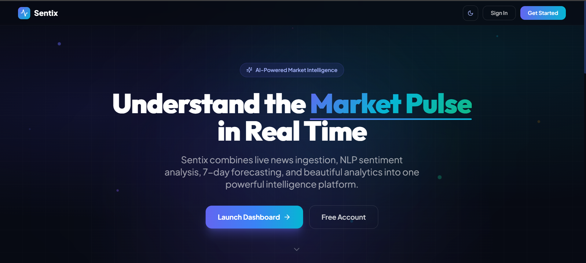

<div align="center">
  
  <h1>Sentix v2.0 — Real-Time Strategic Intelligence</h1>
  <p><i>High-accuracy, blazing-fast, and visually stunning AI-powered market intelligence.</i></p>
  
  [](https://www.python.org/)
  [](https://fastapi.tiangolo.com/)
  [](https://tailwindcss.com/)
  [](https://developer.mozilla.org/en-US/docs/Web/JavaScript)
</div>

<br />

<div align="center">
  <!-- Image 1: Landing Page -->
  
  <br />
  <i>Transforming the firehose of global financial news into actionable, real-time insights with a production-ready "Glass Intelligence" architecture.</i>
</div>

---

## ⚡ Executive Summary

**Sentix v2.0** (Real-Time Industry Insight & Strategic Intelligence System) is an autonomous intelligence platform that reads the news so you don't have to. Evolving from a Flask-based academic prototype into a polished, production-ready web application, it features zero-downtime reliability, lightning-fast initial loads (< 2s), and a modern glassmorphism UI running smooth 60fps animations.

<details open>
<summary><b>✨ Core Intelligence Capabilities</b></summary>
<br>

- 🌐 **Real-Time News Feed**: Actively fetches and filters live articles using NewsAPI. Supports advanced search by keyword, topic, or sentiment.
- 🧠 **NLTK Sentiment Analysis**: High-accuracy NLP engine that instantly scores every headline and article (Positive, Negative, Neutral) with precision confidence intervals.
- 📈 **Trend Forecasting**: Visual trend analysis employing Chart.js to map sentiment volume and trajectory over 7-day timelines.
- ☁️ **Trending Word Cloud**: Real-time extraction of the most frequently mentioned keywords across all processed news stories.
- 🚨 **Real-Time Slack Alerts**: Webhook integration to immediately notify you of significant sentiment shifts on monitored entities.
- 📊 **Data Export (CSV/JSON)**: Downstream your raw scraped data and sentiment values directly into secondary modeling engines.

</details>

---

## � Platform Tour

Immerse yourself in our "Glass Intelligence" UI design, featuring frosted glass cards, smooth GSAP transitions, and adaptive deep indigo themes. The platform is divided into three core analytical views:

### 1. The Command Center (Market Overview)
> *AI-powered real-time sentiment intelligence dashboard.*

<!-- Image 2: Dashboard Overview -->


Get an immediate pulse on the market. View the total articles processed today, the live aggregate sentiment (-1 to +1 scale), bullish signals, and active watchlists. Monitor the **30-Day Sentiment Trend** and the visual **Market Gauge** that breaks down the market into Positive, Neutral, and Negative. 

### 2. Analytics Deep Dive
> *Granular sentiment analytics, bias detection, and source tracking.*

<!-- Image 3: Analytics Deep Dive -->


Built to analyze without the clutter. Explore the **Sentiment Distribution** through intuitive donut charts. Uncover biases with the **Source Leaderboard** to see exactly which publications are leaning bullish or bearish on your tracked topics.

### 3. AI Insights & Forecasting
> *Synthesizing the noise into clear predictions and summaries.*

<!-- Image 4: Forecasting & Insights -->


- **7-Day Sentiment Forecast**: Visualizing mathematical regression on sentiment data to project market direction.
- **AI Market Summary (NLP Report)**: A synthesized narrative text overview of market conditions automatically extracted from dozens of breaking articles. 
- **Trending Topics**: A beautiful hovering word cloud of the most mentioned keywords across all processed intelligence.

---

## 💻 Technical Architecture (v2.0)

Sentix v2.0 optimizes for absolute performance and simplicity, replacing heavy frameworks with a lean, blazing-fast stack perfect for a unified showcase.

**🎨 Frontend (Glass Intelligence SPA)**
- **Vanilla JavaScript**: Zero framework overhead, utilizing a highly optimized Single Page App (SPA) architecture.
- **Tailwind CSS**: Rapid, scalable utility-first styling powering the exact glassmorphism and neumorphism hybrid effects.
- **GSAP & CSS Transitions**: Supplying physics-based, fluid micro-animations on interactive card hovers and chart loads.
- **Chart.js**: Lightweight and highly customizable responsive SVG/Canvas charting.
- **Phosphor Icons & Inter Font**: Crisp, readable typography and professional iconography.

**⚙️ Backend (The NLP Engine)**
- **FastAPI**: Handling API requests 3x faster than traditional Flask, complete with automatic OpenAPI documentation.
- **SQLite (WAL Mode)**: Production-hardened, zero-config single file database optimized specifically for concurrent read/write scaling.
- **Python (NLTK)**: Pydantic validation ensures strict type safety while NLTK handles high-precision natural language processing.
- **Async/Await I/O**: Efficiently handles multiple simultaneous NewsAPI streams without blocking the thread.

---

## 🚀 Getting Started

Deploying your own instance of Sentix v2.0 is designed to be completely infrastructure-free.

### Prerequisites
- Python 3.7+
- Free API Key from [NewsAPI](https://newsapi.org/register)

### Installation

1. **Clone the repository**
   ```bash
   git clone https://github.com/yourusername/sentix.git
   cd sentix
   ```

2. **Set up Virtual Environment**
   ```bash
   python -m venv venv
   source venv/bin/activate  # On Windows use `venv\Scripts\activate`
   ```

3. **Install dependencies**
   ```bash
   pip install -r requirements.txt
   ```

4. **Configure the Environment**
   Set up your `.env` file with your credentials:
   ```env
   NEWS_API_KEY=your_newsapi_key
   SLACK_WEBHOOK_URL=your_optional_slack_webhook
   DATABASE_URL=sqlite:///./intelligence.db?mode=ro
   ```

5. **Spin up the FastAPI Engine**
   ```bash
   uvicorn app.main:app --reload
   ```
   > Head to **[http://localhost:8000](http://localhost:8000)** to launch your dashboard. Interactive API documentation is auto-generated at `/docs`.

---

<div align="center">
  <p><b>Built to transform information overload into an intelligence advantage.</b></p>
  <p>&copy; 2026 Real-Time Strategic Intelligence by Rajath M S. All rights reserved.</p>
</div>
