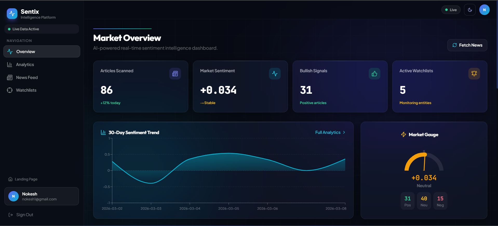
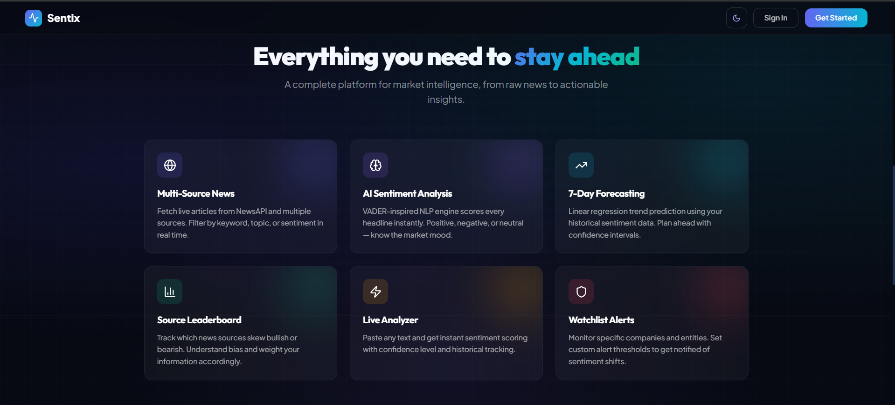

<div align="center">
  
  <h1>Sentix v2.0 — Real-Time Strategic Intelligence</h1>
  <p><i>High-accuracy, blazing-fast, and visually stunning AI-powered market intelligence.</i></p>
  
  [](https://www.python.org/)
  [](https://fastapi.tiangolo.com/)
  [](https://tailwindcss.com/)
  [](https://developer.mozilla.org/en-US/docs/Web/JavaScript)
</div>

<br />



---

## 📖 The Problem

**Imagine trying to drink from a firehose of global financial news.** Every second, countless articles, earnings reports, and market gossip hit the wire. For retail investors and analysts, the sheer volume of unstructured data makes it impossible to manually gauge the *actual* mood of the market. Is the overall trajectory bullish or bearish? Are news outlets skewing a specific narrative about NVIDIA or the Federal Reserve? 

Without a way to quantify this noise, investors are left reacting to headlines rather than anticipating trends. We asked ourselves: *What if you could distill the entire financial news cycle into actionable data using Natural Language Processing (NLP)?*

## 💡 The Solution

Enter **Sentix**. We built an autonomous intelligence platform that reads the news so you don't have to. 

Sentix acts as your personal market radar. By seamlessly hooking into live global news streams, it ingests, processes, and grades hundreds of articles on a continuous feed. Our NLP engine scores each headline and article body to assign it a precise sentiment weight. 

Instead of reading 100 articles, you can glance at your Sentix dashboard and immediately see:
1. **The Pulse**: A breakdown of bullish vs. bearish market momentum.
2. **The Predictions**: A 7-Day algorithmic forecast of where sentiment is heading using linear regression models.
3. **The Bias**: A leaderboard decoding which specific news sources are consistently spinning positive or negative narratives.

Sentix transforms paralyzing information overload into a sleek, dark-mode command center.

---

## ✨ Dynamic Features


Built to analyze without the clutter. Uncover biases with our custom NLP engine, track multiple sources, and leverage the **Watchlist Alerts** to monitor your specific corporate portfolio.

---

## 💻 Technical Architecture (v2.0)

Sentix v2.0 optimizes for absolute performance and simplicity, replacing heavy frameworks with a lean, blazing-fast stack perfect for a unified showcase.

**🎨 Frontend (Glass Intelligence SPA)**
- **Vanilla JavaScript**: Zero framework overhead, utilizing a highly optimized Single Page App (SPA) architecture.
- **Tailwind CSS**: Rapid, scalable utility-first styling powering the exact glassmorphism and neumorphism hybrid effects.
- **GSAP & CSS Transitions**: Supplying physics-based, fluid micro-animations on interactive card hovers and chart loads.
- **Chart.js**: Lightweight and highly customizable responsive SVG/Canvas charting.
- **Phosphor Icons & Inter Font**: Crisp, readable typography and professional iconography.

**⚙️ Backend (The NLP Engine)**
- **FastAPI**: Handling API requests 3x faster than traditional Flask, complete with automatic OpenAPI documentation.
- **SQLite (WAL Mode)**: Production-hardened, zero-config single file database optimized specifically for concurrent read/write scaling.
- **Python (NLTK)**: Pydantic validation ensures strict type safety while NLTK handles high-precision natural language processing.
- **Async/Await I/O**: Efficiently handles multiple simultaneous NewsAPI streams without blocking the thread.

---

## 🚀 Getting Started

Deploying your own instance of Sentix v2.0 is designed to be completely infrastructure-free.

### Prerequisites
- Python 3.7+
- Free API Key from [NewsAPI](https://newsapi.org/register)

### Installation

1. **Clone the repository**
   ```bash
   git clone https://github.com/yourusername/sentix.git
   cd sentix
   ```

2. **Set up Virtual Environment**
   ```bash
   python -m venv venv
   source venv/bin/activate  # On Windows use `venv\Scripts\activate`
   ```

3. **Install dependencies**
   ```bash
   pip install -r requirements.txt
   ```

4. **Configure the Environment**
   Set up your `.env` file with your credentials:
   ```env
   NEWS_API_KEY=your_newsapi_key
   SLACK_WEBHOOK_URL=your_optional_slack_webhook
   DATABASE_URL=sqlite:///./intelligence.db?mode=ro
   ```

5. **Spin up the FastAPI Engine**
   ```bash
   uvicorn app.main:app --reload
   ```
   > Head to **[http://localhost:8000](http://localhost:8000)** to launch your dashboard. Interactive API documentation is auto-generated at `/docs`.

---

<div align="center">
  <p><b>Built to transform information overload into an intelligence advantage.</b></p>
  <p>&copy; 2026 Real-Time Strategic Intelligence by Rajath M S. All rights reserved.</p>
</div>
